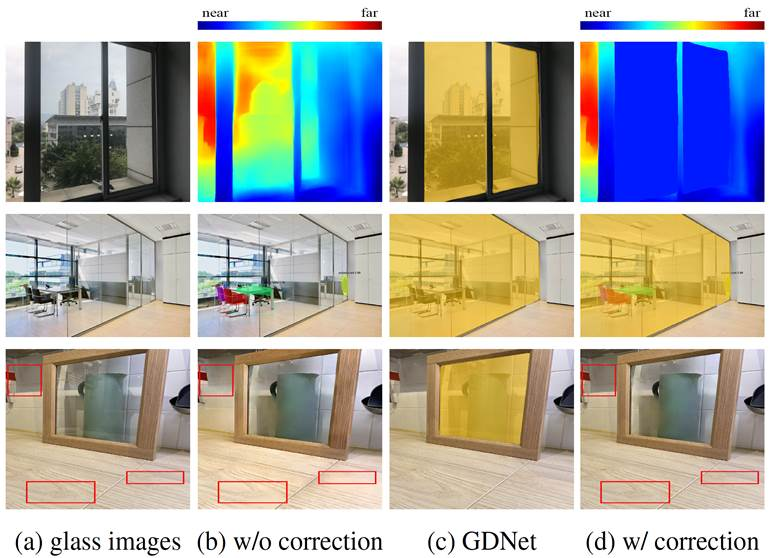

# -Mirror-Glass-Detection-

+--------------------------------------------------------------------------+  
| **Mirror and Glass Detection/Segmentation**                              |  
+--------------------------------------------------------------------------+  
|                                                                          |  
|                                                                          |  
| In this project, we are developing techniques for mirror and glass       |  
| detection/segmentation. While a mirror is a reflective surface that      |  
| reflects the scene in front of it, glass is a transparent surface that   |  
| transmits the scene from the back side and often also reflects the scene |  
| in front of it too. In general, both mirrors and glass do not have their |  
| own visual appearances. They only reflect/transmit the appearances of    |  
| their surroundings.                                                      |  
|                                                                          |  
| As mirrors and glass do not have their own appearances, it is not        |  
| straightforward to develop automatic algorithms to detect and segment    |  
| them. However, as they appear everywhere in our daily life, it can be    |  
| problematic if we are not able to detect them reliably. For example, a   |  
| vision-based depth sensor may falsely estimate the depth of a piece of   |  
| mirror/glass as the depth of the objects inside it, a robot may not be   |  
| aware of the presence of a mirror/glass wall, and a drone may collide    |  
| into a high rise (noted that most high rises are covered by glass these  |  
| days).                                                                   |  
|                                                                          |  
| To the best of our knowledge, my team is the first to develop            |  
| computational models for automatic detection and segmentation of mirror  |  
| and transparent glass surfaces. Although there have been some works that |  
| investigate the detection of transparent glass objects, these methods    |  
| mainly focus on detecting wine glass and small glass objects, which have |  
| some special visual properties that can be used for detection. Unlike    |  
| these works, we are more interested in detecting general glass surfaces  |  
| that may not possess any special properties of their own.                |  
|                                                                          |  
| We are also interested in exploring the application of our mirror/glass  |  
| detection methods in autonomous navigation.                              |  
+--------------------------------------------------------------------------+  
| **Progressive Mirror Detection**                                         |  
| [[paper](http://www.cs.cityu.edu.hk/~rynson/papers/cvpr20c.pdf)]         |  
| [[suppl](http://www.cs.cityu.edu.hk/~rynson/papers/demos/cvpr20c-supp.pd |  
| f)]                                                                      |  
| [code] [dataset]                                                         |  
|                                                                          |  
| Jiaying Lin, Guodong Wang, and Rynson Lau                                |  
|                                                                          |  
| ***Proc. IEEE CVPR***, June 2020                                         |  
+--------------------------------------------------------------------------+  
| +----------------------------------------------------------------------- |  
| ---+                                                                     |  
| |                          |  
|    |                                                                     |  
| |                                                                        |  
|    |                                                                     |  
| | Visualization of our progressive approach to recognizing mirrors from  |  
| a  |                                                                     |  
| | single image. By finding correspondences between objects inside and    |  
|    |                                                                     |  
| | outside of the mirror and then explicitly locating the miror edges, we |  
|    |                                                                     |  
| | can detect the mirror region more reliably.                            |  
|    |                                                                     |  
| +----------------------------------------------------------------------- |  
| ---+                                                                     |  
+--------------------------------------------------------------------------+  
| **Input-Output:**Given an input image, our network outputs a binary mask |  
| that indicate where mirrors are.                                         |  
|                                                                          |  
| **Abstract.** The mirror detection problem is important as mirrors can   |  
| affect the performances of many vision tasks. It is a difficult problem  |  
| since it requires an understanding of global scene semantics. Recently,  |  
| a method was proposed to detect mirrors by learning multi-level          |  
| contextual contrasts between inside and outside of mirrors, which helps  |  
| locate mirror edges implicitly. We observe that the content of a mirror  |  
| reflects the content of its surrounding, separated by the edge of the    |  
| mirror. Hence, we propose a model in this paper to progressively learn   |  
| the content similarity between the inside and outside of the mirror      |  
| while explicitly detecting the mirror edges. Our work has two main       |  
| contributions. First, we propose a new relational contextual contrasted  |  
| local (RCCL) module to extract and compare the mirror features with its  |  
| corresponding context features, and an edge detection and fusion (EDF)   |  
| module to learn the features of mirror edges in complex scenes via       |  
| explicit supervision. Second, we construct a challenging benchmark       |  
| dataset of 6,461 mirror images. Unlike the existing MSD dataset, which   |  
| has limited diversity, our dataset covers a variety of scenes and is     |  
| much larger in scale. Experimental results show that our model           |  
| outperforms relevant state-of-the-art methods.                           |  
+--------------------------------------------------------------------------+  
| +----------------------------------------------------------------------- |  
| ---+                                                                     |  
| | **Don�t Hit Me! Glass Detection in Real-world Scenes**                 |  
|    |                                                                     |  
| | [[paper](http://www.cs.cityu.edu.hk/~rynson/papers/cvpr20d.pdf)]       |  
|    |                                                                     |  
| | [[suppl](http://www.cs.cityu.edu.hk/~rynson/papers/demos/cvpr20d-supp. |  
| pd |                                                                     |  
| | f)]                                                                    |  
|    |                                                                     |  
| | [code] [dataset]                                                       |  
|    |                                                                     |  
| |                                                                        |  
|    |                                                                     |  
| | Haiyang Mei, Xin Yang, Yang Wang, Yuanyuan Liu, Shengfeng He, Qiang    |  
|    |                                                                     |  
| | Zhang, Xiaopeng Wei, and Rynson Lau                                    |  
|    |                                                                     |  
| |                                                                        |  
|    |                                                                     |  
| | ***Proc. IEEE CVPR***, June 2020                                       |  
|    |                                                                     |  
| +----------------------------------------------------------------------- |  
| ---+                                                                     |  
| | +--------------------------------------------------------------------- |  
| -- |                                                                     |  
| | ---+                                                                   |  
|    |                                                                     |  
| | |                        |  
|    |                                                                     |  
| |    |                                                                   |  
|    |                                                                     |  
| | |                                                                      |  
|    |                                                                     |  
| |    |                                                                   |  
|    |                                                                     |  
| | | Problems with glass in existing vision tasks. In depth prediction,   |  
|    |                                                                     |  
| |    |                                                                   |  
|    |                                                                     |  
| | | existing method [16] wrongly predicts the depth of the scene behind  |  
| th |                                                                     |  
| | e  |                                                                   |  
|    |                                                                     |  
| | | glass, instead of the depth to the glass (1st row of (b)). For insta |  
| nc |                                                                     |  
| | e  |                                                                   |  
|    |                                                                     |  
| | | segmentation, Mask RCNN [9] only segments the instances behind the   |  
|    |                                                                     |  
| |    |                                                                   |  
|    |                                                                     |  
| | | glass, not aware that they are actually behind the glass (2nd row of |  
|    |                                                                     |  
| |    |                                                                   |  
|    |                                                                     |  
| | | (b)). Besides, if we directly apply an existing singe-image reflecti |  
| on |                                                                     |  
| |    |                                                                   |  
|    |                                                                     |  
| | | removal (SIRR) method [36] to an image that is only partially covere |  
| d  |                                                                     |  
| | by |                                                                   |  
|    |                                                                     |  
| | | glass, the non-glass region can be corrupted (3rd row of (b)). GDNet |  
|  c |                                                                     |  
| | an |                                                                   |  
|    |                                                                     |  
| | | detect the glass (c) and then correct these failure cases (d).       |  
|    |                                                                     |  
| |    |                                                                   |  
|    |                                                                     |  
| | +--------------------------------------------------------------------- |  
| -- |                                                                     |  
| | ---+                                                                   |  
|    |                                                                     |  
| +----------------------------------------------------------------------- |  
| ---+                                                                     |  
| | **Input-Output:**Given an input image, our network outputs a binary ma |  
| sk |                                                                     |  
| | that indicate where transparent glass regions are.                     |  
|    |                                                                     |  
| |                                                                        |
|    |                                                                     |
| | **Abstract.** Transparent glass is very common in our daily life.      |
|    |                                                                     |
| | Existing computer vision systems neglect it and thus may have severe   |
|    |                                                                     |
| | consequences, e.g., a robot may crash into a glass wall. However,      |
|    |                                                                     |
| | sensing the presence of glass is not straightforward. The key challeng |
| e  |                                                                     |
| | is that arbitrary objects/scenes can appear behind the glass, and the  |
|    |                                                                     |
| | content within the glass region is typically similar to those behind i |
| t. |                                                                     |
| | In this paper, we propose an important problem of detecting glass from |
|  a |                                                                     |
| | single RGB image. To address this problem, we construct a large-scale  |
|    |                                                                     |
| | glass detection dataset (GDD) and design a glass detection network,    |
|    |                                                                     |
| | called GDNet, which explores abundant contextual cues for robust glass |
|    |                                                                     |
| | detection with a novel large-field contextual feature integration (LCF |
| I) |                                                                     |
| | module. Extensive experiments demonstrate that the proposed method     |
|    |                                                                     |
| | achieves more superior glass detection results on our GDD test set tha |
| n  |                                                                     |
| | state-of-the-art methods fine-tuned for glass detection.               |
|    |                                                                     |
| +----------------------------------------------------------------------- |
| ---+                                                                     |
+--------------------------------------------------------------------------+
| +----------------------------------------------------------------------- |
| ---+                                                                     |
| | **Where is My Mirror?**                                                |
|    |                                                                     |
| | [[paper](http://www.cs.cityu.edu.hk/~rynson/papers/iccv19a.pdf)]       |
|    |                                                                     |
| | [[suppl](http://www.cs.cityu.edu.hk/~rynson/papers/demos/iccv19a-supp. |
| pd |                                                                     |
| | f)]                                                                    |
|    |                                                                     |
| | [[code and updated                                                     |
|    |                                                                     |
| | results](https://github.com/Mhaiyang/ICCV2019_MirrorNet)]              |
|    |                                                                     |
| | [[dataset](https://drive.google.com/file/d/1Znw92fO6lCKfXejjSSyMyL1qtF |
| ep |                                                                     |
| | gjPI/view?usp=sharing)]                                                |
|    |                                                                     |
| |                                                                        |
|    |                                                                     |
| | Xin Yang\*, Haiyang Mei\*, Ke Xu, Xiaopeng Wei, Baocai Yin, and Rynson |
|    |                                                                     |
| | Lau (\* joint first authors)                                           |
|    |                                                                     |
| |                                                                        |
|    |                                                                     |
| | ***Proc. IEEE ICCV***, Oct. 2019                                       |
|    |                                                                     |
| +----------------------------------------------------------------------- |
| ---+                                                                     |
| | +--------------------------------------------------------------------- |
| -- |                                                                     |
| | ---+                                                                   |
|    |                                                                     |
| | |                        |
|    |                                                                     |
| |    |                                                                   |
|    |                                                                     |
| | |                                                                      |
|    |                                                                     |
| |    |                                                                   |
|    |                                                                     |
| | | Problems with mirrors in existing vision tasks. In depth prediction, |
|    |                                                                     |
| |    |                                                                   |
|    |                                                                     |
| | | NYU-v2 dataset [32] uses a Kinect to capture depth as ground truth.  |
| It |                                                                     |
| |    |                                                                   |
|    |                                                                     |
| | | wrongly predicts the depths of the reflected contents, instead of th |
| e  |                                                                     |
| |    |                                                                   |
|    |                                                                     |
| | | mirror depths (b). In instance semantic segmentation, Mask RCNN [12] |
|    |                                                                     |
| |    |                                                                   |
|    |                                                                     |
| | | wrongly detects objects inside the mirrors (c). With MirrorNet, we f |
| ir |                                                                     |
| | st |                                                                   |
|    |                                                                     |
| | | detect and mask out the mirrors (d). We then obtain the correct dept |
| hs |                                                                     |
| |    |                                                                   |
|    |                                                                     |
| | | (e), by interpolating the depths from surrounding pixels of the mirr |
| or |                                                                     |
| | s, |                                                                   |
|    |                                                                     |
| | | and segmentation maps (f).                                           |
|    |                                                                     |
| |    |                                                                   |
|    |                                                                     |
| | +--------------------------------------------------------------------- |
| -- |                                                                     |
| | ---+                                                                   |
|    |                                                                     |
| +----------------------------------------------------------------------- |
| ---+                                                                     |
| | **Input-Output:**Given an input image, our network outputs a binary ma |
| sk |                                                                     |
| | that indicate where mirrors are.                                       |
|    |                                                                     |
| |                                                                        |
|    |                                                                     |
| | **Abstract.** Mirrors are everywhere in our daily lives. Existing      |
|    |                                                                     |
| | computer vision systems do not consider mirrors, and hence may get     |
|    |                                                                     |
| | confused by the reflected content inside a mirror, resulting in a seve |
| re |                                                                     |
| | performance degradation. However, separating the real content outside  |
| a  |                                                                     |
| | mirror from the reflected content inside it is non-trivial. The key    |
|    |                                                                     |
| | challenge is that mirrors typically reflect contents similar to their  |
|    |                                                                     |
| | surroundings, making it very difficult to differentiate the two. In th |
| is |                                                                     |
| | paper, we present a novel method to segment mirrors from an input imag |
| e. |                                                                     |
| | To the best of our knowledge, this is the first work to address the    |
|    |                                                                     |
| | mirror segmentation problem with a computational approach. We make the |
|    |                                                                     |
| | following contributions. First, we construct a large-scale mirror      |
|    |                                                                     |
| | dataset that contains mirror images with corresponding manually        |
|    |                                                                     |
| | annotated masks. This dataset covers a variety of daily life scenes, a |
| nd |                                                                     |
| | will be made publicly available for future research. Second, we propos |
| e  |                                                                     |
| | a novel network, called MirrorNet, for mirror segmentation, by modelin |
| g  |                                                                     |
| | both semantical and low-level color/texture discontinuities between th |
| e  |                                                                     |
| | contents inside and outside of the mirrors. Third, we conduct extensiv |
| e  |                                                                     |
| | experiments to evaluate the proposed method, and show that it          |
|    |                                                                     |
| | outperforms the carefully chosen baselines from the state-of-the-art   |
|    |                                                                     |
| | detection and segmentation methods                                     |
|    |                                                                     |
| +----------------------------------------------------------------------- |
| ---+                                                                     |
+--------------------------------------------------------------------------+

*Last updated in July 2020.*
