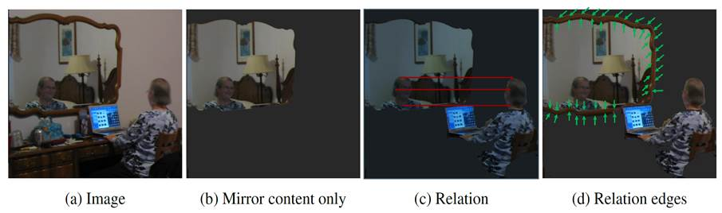
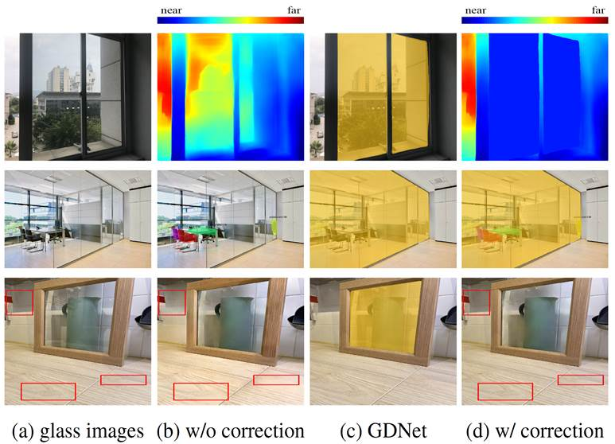
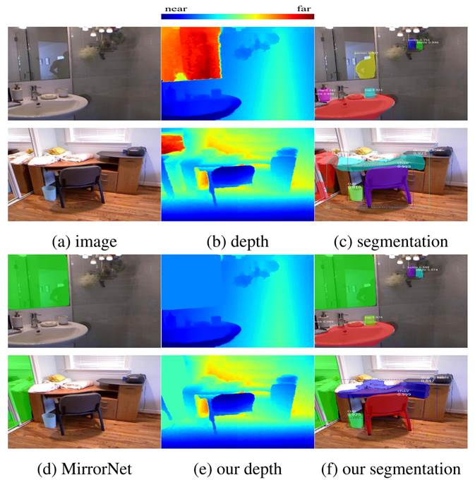

# 镜面/玻璃真实场景中的检测和语义分割

<a href="https://github.com/Charmve" target="_blank">Charmve</a> | <a href="README.md" target="_blank">English</a> | Chinese

    

  
  
  
  

 <strong>Mirror and Glass Detection/Segmentation</strong>

 

在这个项目中，我正在学习反射镜和玻璃检测/分段技术。镜子是反射表面，可以反射前面的场景，而玻璃是透明表面，可以从背面透射场景，通常也可以反射前面的场景。通常，镜子和玻璃都没有自己的视觉外观，它们仅反射/透射周围环境的外观。

由于镜子和玻璃没有自己的外观，因此开发自动算法进行检测和分段并不是一件容易的事。但是，由于它们在我们的日常生活中无处不在，因此如果我们无法可靠地检测到它们，可能会出现问题。例如，基于视觉的深度传感器可能会错误地估计一块镜子/玻璃的深度，因为它内部的物体的深度，机器人可能没有意识到镜子/玻璃墙的存在以及无人机可能碰撞成高楼（请注意，这些天大多数高楼都被玻璃遮盖了）。

到目前为止，尽管香港城大实验室是第一个开发用于自动检测和分割镜面和透明玻璃表面的计算模型的研究团队，有了一些研究调查透明玻璃物体的工作，但是这些方法主要集中在检测酒杯和小玻璃物体上，它们具有一些可用于检测的特殊视觉特性。与这些作品不同，我对检测可能不具有任何特殊属性的普通玻璃表面更感兴趣。

我也有兴趣探索镜子/玻璃检测方法在自主导航中的应用。视频：https://www.zhihu.com/zvideo/1302257849481818112

## 渐进镜检测

Progressive Mirror Detection

  [<a href="http://www.cs.cityu.edu.hk/~rynson/papers/cvpr20c.pdf" target="_blank">paper</a>] |
  [<a href="http://www.cs.cityu.edu.hk/~rynson/papers/demos/cvpr20c-supp.pdf" target="_blank">suppl</a>]|
  [code] |
  [dataset] 

Jiaying Lin, Guodong Wang, and Rynson Lau  
  <i>Proc. IEEE CVPR</i>, June 2020

  
  

    <i><b>图 1</b>. 将从单个图像识别镜子的渐进方法可视化。通过查找镜子内部和外部对象之间的对应关系，然后明确定位镜子边缘，可以更可靠地检测镜子区域。</i>
  

 

<b>输入-输出:</b>给定一个输入图像，网络将输出一个二进制掩码，以指示镜像的位置。

  <b>摘要：</b> 
  镜子检测问题很重要，因为镜子会影响许多视觉任务的性能。并且也是一个难题，因为它需要了解全局场景语义。
  文中作者提出了一种通过学习镜子内部和外部之间的多级上下文对比来检测镜子的方法，该方法有助于隐式定位镜子边缘。
  他们观察到镜子的内容反映了其周围的内容，被镜子的边缘分开。因此，作者在本文中提出了一个模型，以逐步学习镜子内部和外部之间的内容相似性，同时明确检测镜子边缘。
  他们的工作有两个主要贡献。
  首先，作者提出了一种新的关系上下文对比局部（RCCL）模块来提取和比较镜像特征及其对应的上下文特征，以及一种边缘检测和融合（EDF）模块以通过显式监督来学习复杂场景中的镜像边缘特征。
  其次，他们构建了一个具有挑战性的基准数据集，包含6,461幅镜像图像。与现有的MSD数据集（多样性有限）不同，作者的数据集涵盖了各种场景，并且规模更大。
  实验结果表明，该模型优于相关的最新方法。

                  

 
## Don't Hit Me! Glass Detection in Real-world Scenes   

  [<a href="http://www.cs.cityu.edu.hk/~rynson/papers/cvpr20d.pdf" target="_blank">paper</a>] | 
  [<a href="http://www.cs.cityu.edu.hk/~rynson/papers/demos/cvpr20d-supp.pdf" target="_blank">suppl</a>] | 
  [<a href="https://github.com/Charmve/Mirror-Glass-Detection/tree/master/CVPR2020_GDNet" target="_blank">code</a>] | 
  [<a href="https://github.com/Charmve/Mirror-Glass-Detection/tree/master/Dataset/train" target="_blank">dataset</a>]

 
  

 Haiyang Mei, Xin Yang, Yang Wang, Yuanyuan Liu, Shengfeng He, Qiang Zhang, Xiaopeng Wei, and Rynson Lau  
  <i>Proc. IEEE CVPR</i>, June 2020 

  

  
  

    <i><b>图 2</b>. 现有视觉任务中的玻璃问题。在深度预测中，现有方法[16]错误地预测了场景在玻璃后面的深度，而不是到玻璃的深度（（b）的第一行）。 例如，Mask-RCNN [9]仅将实例分割在玻璃后面，而不知道它们实际上在玻璃后面（（b）的第二行）。
    此外，如果我们直接将现有的单一图像反射消除（SIRR）方法[36]应用于仅部分被玻璃覆盖的图像，则非玻璃区域可能会损坏（（b）的第三行）。 GDNet可以检测到玻璃（c），然后纠正这些故障情况（d）。</i>
  

 

<b>输入-输出:</b>给定输入图像，作者的网络将输出一个二进制遮罩，以指示透明玻璃区域的位置。

<b>摘要：</b> 
透明玻璃在我们的日常生活中非常普遍。 现有的计算机视觉系统忽略了它，因此可能产生严重的后果，例如：机器人可能会撞入玻璃墙。 但是，检测玻璃的存在并不容易。关键挑战在于，任意物体/场景都可能出现在玻璃后面，并且玻璃区域内的内容通常类似于玻璃后面的内容。在本文中，作者提出了一个从单个RGB图像检测玻璃的重要问题。
为了解决这个问题，作者构建了一个大规模的玻璃检测数据集（GDD），并设计了一个名为GDNet的玻璃检测网络，该网络使用新颖的大视野上下文特征集成（LCFI）模块探索了用于可靠的玻璃检测的大量上下文线索。 大量实验表明，与针对玻璃检测进行微调的最先进方法相比，该方法在GDD测试仪上可获得更好的玻璃检测结果。

                  

 

## Where is My Mirror?

  [<a href="http://www.cs.cityu.edu.hk/~rynson/papers/iccv19a.pdf" target="_blank">paper</a>] | 
  [<a href="http://www.cs.cityu.edu.hk/~rynson/papers/demos/iccv19a-supp.pdf" target="_blank">suppl</a>]| 
  [<a href="https://github.com/Charmve/Mirror-Glass-Detection/tree/master/ICCV2019_MirrorNet" target="_blank">code and updated</a>] |
  [<a href="https://drive.google.com/file/d/1Znw92fO6lCKfXejjSSyMyL1qtFepgjPI/view?usp=sharing" target="_blank">dataset</a>]

 
 

Xin Yang\*, Haiyang Mei\*, Ke Xu, Xiaopeng Wei, Baocai Yin, and Rynson Lau (\* joint first authors)  
  <i>Proc. IEEE ICCV</i>, Oct. 2019 

 
 

  
  

    <i><b>图 3</b>.现有视觉任务中的镜子检测问题。在深度预测中，NYU-v2数据集[32]使用Kinect捕获深度作为地面真实情况。它错误地预测了反射内容的深度，而不是镜面深度（b）。
    在实例语义分割中，Mask RCNN [12]错误地检测到镜像内部的对象（c）。 借助MirrorNet，作者首先检测并屏蔽了镜像（d）。 然后，通过对反射镜周围像素和分割图（f）进行插值，获得正确的深度（e）。 </i>
  

 

<b>输入-输出:</b>给定一个输入图像，网络将输出一个二进制掩码，以指示镜像的位置。

<b>摘要：</b> 
镜子在我们的日常生活中无处不在。现有的计算机视觉系统不考虑镜子，因此可能会被镜子内部的反射内容弄糊涂，从而导致严重的性能下降。然而，将镜外的真实内容与镜内的反射内容分开，对计算机而言是有很大挑战的。
关键的挑战是，镜子通常会反射与其周围环境相似的内容，因此很难区分两者。在本文中，作者提出了一种从输入图像中分割镜子的新颖方法。据作者表述，这是使用计算方法解决镜像分割问题的第一项工作。

他们做出了以下贡献：
- 首先，构建了一个大型镜像数据集，其中包含带有相应的手动注释蒙版的镜像。该数据集涵盖了各种日常生活场景，并将公开提供以供将来研究。
- 其次，通过对镜子内部和外部内容之间的语义和低级颜色/纹理不连续性进行建模，提出了一种称为MirrorNet的新型网络，用于镜子分割。
- 第三，进行了广泛的实验以评估所提出的方法，并表明它优于最新检测和分割方法中精心选择的基准。

                  
 
 

*<i>最后一次更新：2020.11.01</i> 
文字引用自香港城大计算机系官网 <a href="https://www.cs.cityu.edu.hk/" target="_blank">https://www.cs.cityu.edu.hk/</a>，感谢！

